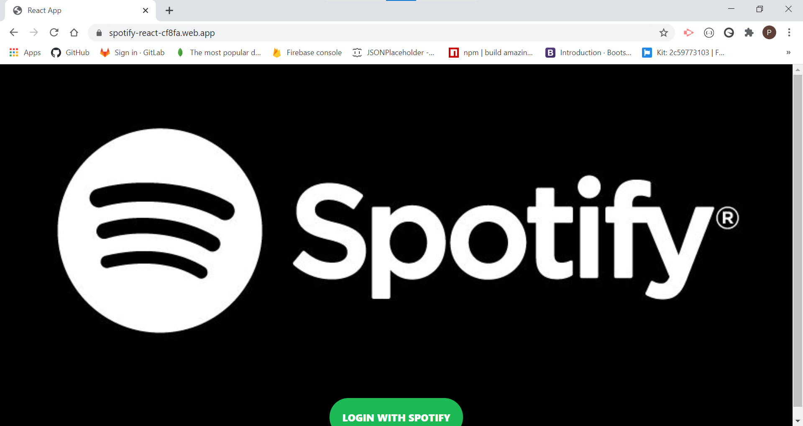

# Spotify React Clone

## Description

This is a frontend application in where the user is able to connect to their very own spotify account and is able to see their own playlists, their spotify avatar and see and listen to their own discover weekly playlist. 

## Technologies

- Firebase
- React
- Material UI
- Spotify API
- React spotify player
- Context API

## Demonstration

## Future Development

Using react-dom to go to different playlists. Have a ways to authenticate logout functionality. Also using the search bar on top to be able to filter the tracks by title.

## Developer

Peter Sammon
